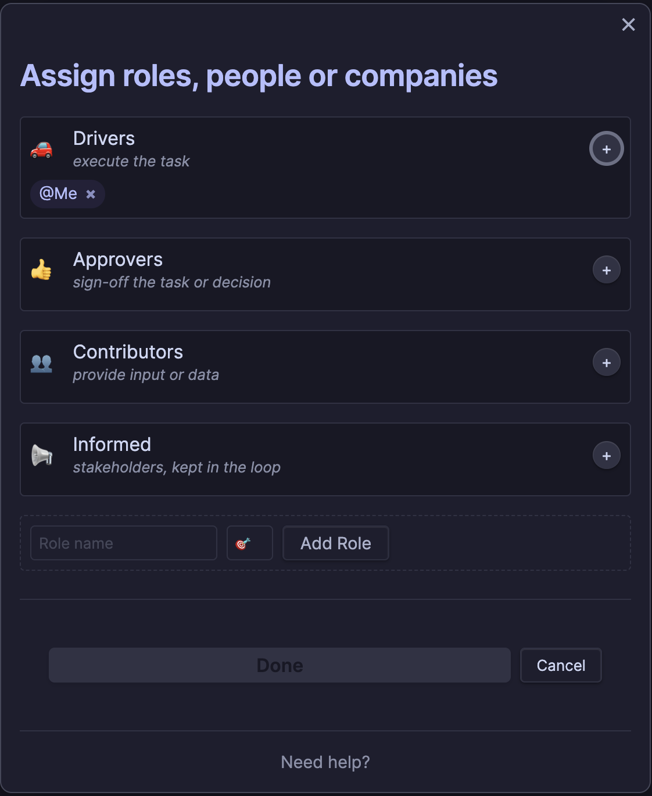
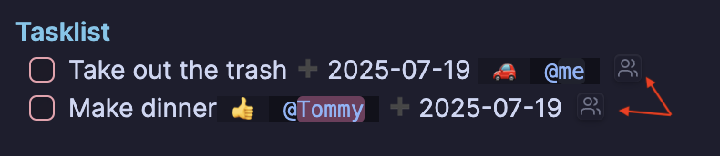

# Task Roles 🗂️

_Assign DACI-style roles (“Driver, Approver, Contributor, Informed” or your own) to any markdown task and review them in
a powerful Task Center._

[](https://github.com/lc0rp/obsidian-task-roles/releases)
[](https://github.com/lc0rp/obsidian-task-roles/releases)
[](LICENSE.md)

<p align="center">
   
</p>
---

I often find myself creating sub-tasks like: _Update legal weekly_, or _Inform Jane about supplier delays_, and wishing
I could add this context to the main task instead.  Tags become messy quickly; they're too unstructured for me.

So I've built **Task Roles**, an [Obsidian](https://obsidian.md/) plugin, to provide a quick shorthand for adding and
tracking who’s involved and how, directly within tasks.

If you find this helpful or have ideas to improve it, I'd love to hear from you!

---

## ✨ Why you’ll love it

* **One-click role assignment** – a tiny 👤 icon appears at the end of every task line; click to pick people/companies
and their role.
* **Inline shortcuts** – type `\d`, `\a`, `\c`, or `\i` to drop in Driver, Approver, Contributor, Informed fields without
leaving the keyboard.  
* **@People & +Companies autocompletion**  – link tasks to people (`@Jane`) or companies (`+AcmeCorp`) pulled from
folders you specify.
* **Custom roles & icons** – hide DACI defaults you don’t need or add your own (e.g. `Reviewer 🔍`).  
* **Task Center dashboard** – filter by status, role, person, due date and more in real time.

### Example of a tasklist with roles assigned



---

## 🚀 Quick Start

1. **Install the plugin**: See installation instructions below

2. Create a task:

   ```markdown
   - [ ] Ship Q3 roadmap
   ```

3. Start typing – the 👤 icon pops in. Click it, set yourself as **Driver**, your PM as **Approver**, and watch the inline
roles appear:

   ```markdown
   - [ ] Ship Q3 roadmap [👤:: @me] [👍:: @PM]
   ```

Done! Every future task is just as easy.

## 🪛 Installation

**BRAT install**: Until this plugin is published to the Obsidian community, you can install it by using
 the [BRAT](https://github.com/TfTHacker/obsidian42-brat) plugin.

* Install the BRAT plugin if you haven't already.
* Open the BRAT settings and add the following URL to the "Beta Plugin List", and click "Add Beta Plugin"

```text
https://github.com/lc0rp/obsidian-task-roles
```

**Manual install**: Download from the [releases page](https://github.com/lc0rp/obsidian-task-roles/releases), unzip to
`<your-vault>/.obsidian/plugins/obsidian-task-roles/`, then reload Obsidian.

---

## 🛠️ Using the Task Center

Open via **Cmd/Ctrl‑P → “Open Task Center”**, the ribbon icon, or your own hotkey.  
Switch between four views:

| View | Ideal for |
|------|-----------|
| **Status** | Kanban‑style progress (To Do, In Progress, Done, Cancelled) |
| **Role** | See who’s blocking what |
| **Assignees** | Everything one person or company is attached to |
| **Date** | Overdue, Today, This Week, Next Week |

Filters (multi‑select, live‑update) let you combine role + person + status + tag + date for laser‑focused lists.

---
Settings highlights

* **Person/Company prefix** – swap `@` or `+` for anything else.  
* **Role manager** – hide defaults, change order, or add custom roles + emoji/icon.  
* **Compact filters** – turn the Task Center header into a single‑row toolbar.

Full settings reference lives in the in‑app **Settings → Task Roles** tab.

---

## 🤝 Integrations & Compabilility

| Tool | Works with |
|------|------------|
| **Obsidian Tasks** | Role shortcuts fall back to `\` triggers when Tasks’ own suggestions are active. |
| **Dataview** | Inline roles are stored as Dataview properties (`[👤:: @Alice]`), so you can query them. |
| **Symbol Linking** | Align the symbols used for @people & +companies. |

---

## 📚 FAQ

1. **Does this change my markdown?**  
   Only by appending Dataview‑style inline fields (`[👤:: @Alice]`). Remove them and the file is plain markdown again.

2. **What if I rename a person?**  
   Use Obsidian’s file‑rename; links update automatically.

3. **Can I disable the 👤 icon?**  
   Yes – _Settings → Task Roles → Inline widget → Disable_.

More questions? Open a [Discussion](https://github.com/lc0rp/obsidian-task-roles/discussions).

---

## 🏗️ Contributing

```bash
git clone https://github.com/lc0rp/obsidian-task-roles.git
cd obsidian-task-roles
npm i
npm run dev   # hot‑reloads into your test vault
```

PRs and issue reports are welcome!

---

## 🗺️ Roadmap

* 🔄 Bulk‑edit roles across multiple tasks
* 🗓️ Calendar overlay in Task Center  
* ☁️ Optional remote cache for large vaults

---

## License

[MIT](LICENSE.md) – do what you want, just keep the copyright notice.

---

### Acknowledgements

Built with ❤ on top of the Obsidian API and inspired by team‑task frameworks like DACI and RACI.

Also:

* [Task Notes](https://github.com/callumalpass/tasknotes): Inspired the inline widget. I'd like to add Task Notes
compatibility soon.

* [Symbol Linking](https://github.com/Ebonsignori/obsidian-at-symbol-linking): Inspired the @person and +company symbols.
